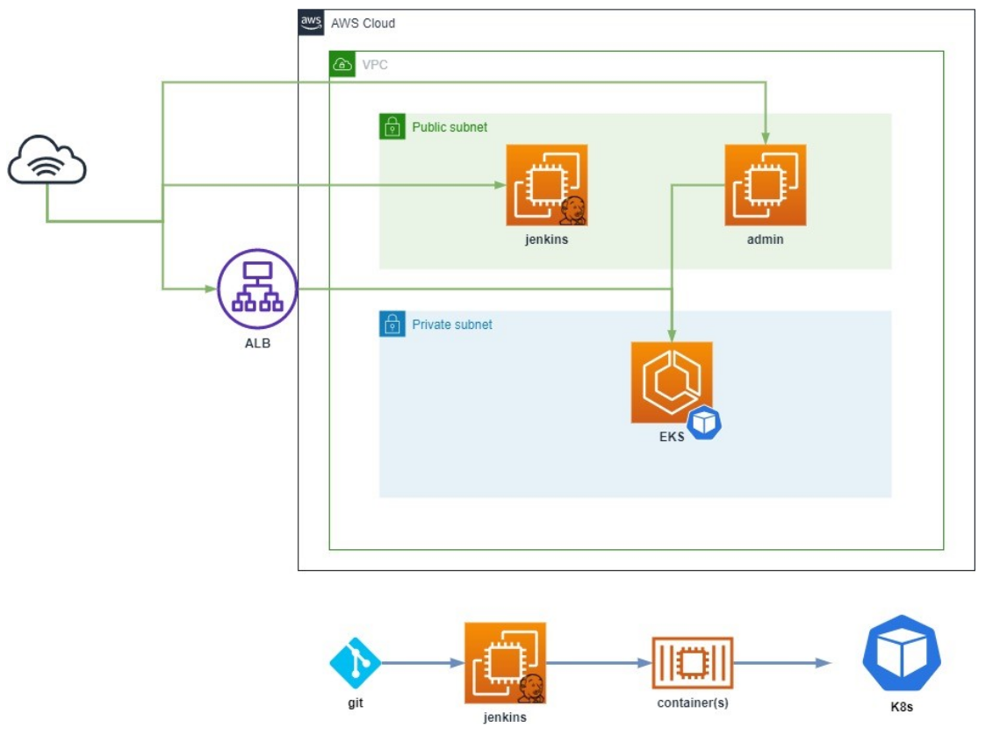

# Ansible-aws-challenge
This repository contains an ansible deployment for the following architecture

# Requirements 
- Ansible >= 2.9
- Python >= 3.0.0
- boto-core
- boto3

# Assumptions
AWS credentials must be configured in the environment.

# Execution
- Go to repo root directory

`$ cd ansible-aws-challenge`
- Execute main playbook
`$ ansible-playbook infra.yml`

# TO-DOs
- Deploy EKS with a toy web app
- Configure ALB connection with EKS
- Create and configure CI/CD process

